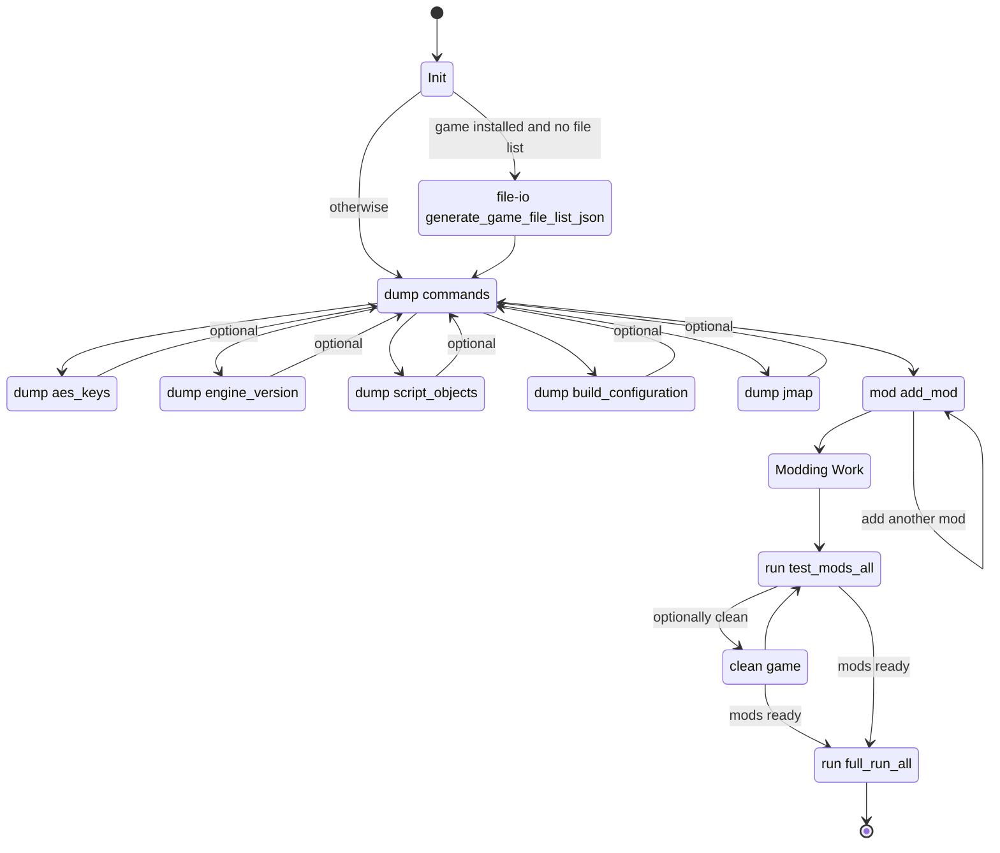

```mermaid
stateDiagram-v2
    [*] --> Init

    Init --> GenerateGameFileList : game installed and no file list
    Init --> DumpEntry : otherwise

    GenerateGameFileList --> DumpEntry

    %% Dumpers (all optional, loop back)
    DumpEntry --> DumpAESKeys
    DumpEntry --> DumpEngineVersion
    DumpEntry --> DumpScriptObjects
    DumpEntry --> DumpBuildConfiguration
    DumpEntry --> DumpJMap
    DumpEntry --> AddMod

    DumpAESKeys --> DumpEntry : optional
    DumpEngineVersion --> DumpEntry : optional
    DumpScriptObjects --> DumpEntry : optional
    DumpBuildConfiguration --> DumpEntry : optional
    DumpJMap --> DumpEntry : optional

    AddMod --> AddMod : add another mod
    AddMod --> UnrealEngineWork

    UnrealEngineWork --> TestModsAll

    TestModsAll --> CleanupPartial : optionally clean
    CleanupPartial --> TestModsAll
    CleanupPartial --> FullRunAll : mods ready

    TestModsAll --> FullRunAll : mods ready

    FullRunAll --> [*]

    %% States with readable labels
    state "file-io generate_game_file_list_json" as GenerateGameFileList
    state "dump aes_keys" as DumpAESKeys
    state "dump engine_version" as DumpEngineVersion
    state "dump script_objects" as DumpScriptObjects
    state "dump build_configuration" as DumpBuildConfiguration
    state "dump jmap" as DumpJMap
    state "mod add_mod" as AddMod
    state "Modding Work" as UnrealEngineWork
    state "run test_mods_all" as TestModsAll
    state "clean game" as CleanupPartial
    state "run full_run_all" as FullRunAll
    state "dump commands" as DumpEntry
```
